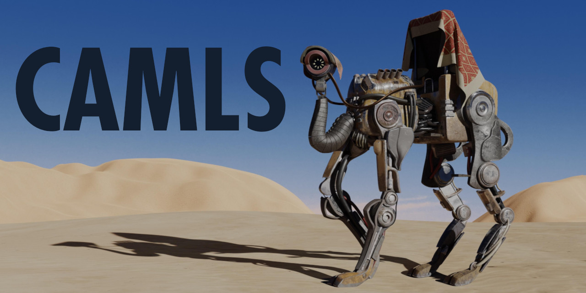

🐪 Hello, and welcome to Camls!

This project is where I store the projects I build while learning to Ocaml.

## The List

- [Build Environments](buildenvs/): Can build programs manually, with makefiles, or with dune
- [CLI Tools](thecli/): Simple programs that use cmdliner for CLI input
- [JSON](doingjson/): Uses the yojson module to read and write JSON.
- [DBs with sqlite](whatevdb/): Reads and writes from sqlite. Even stores json in it.
- [Functors](funks/): Examples of functors.
